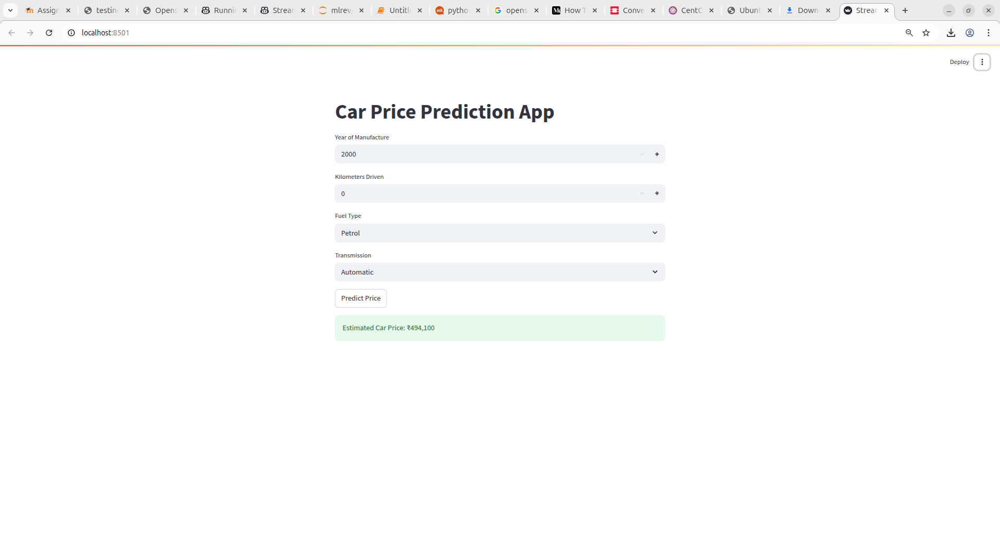

# Retail Data Integration & Car Price Prediction (Streamlit ML Project)



---

## Overview

This project demonstrates:
- **Data integration and validation** across sales, product, and store datasets for a retail chain.
- **Data cleaning, merging, concatenation, null value handling, extraction, and validation** using pandas.
- **Car price prediction** using a machine learning model (Random Forest).
- **Streamlit web app** for car price prediction with an interactive UI.

---

## Step-by-Step Project Process

### **1. Data Preparation**
- Created sample datasets for sales, products, and store information using Python dictionaries.
- Exported these datasets as CSV files (`sales_data.csv`, `product_master.csv`, `store_info.csv`) using pandas.

### **2. Data Cleaning & Merging**
- Loaded the CSVs as DataFrames.
- Merged them into a master DataFrame using pandas `merge`, keeping only records present in all datasets.
- Appended a new sample record to demonstrate dynamic data addition.

### **3. Data Concatenation**
- Simulated adding new stores by creating a new DataFrame.
- Concatenated existing and new store information, reset index, and assigned a "store_status" column.

### **4. Null Value Investigation**
- Intentionally introduced null values in the product master data.
- Demonstrated how to detect, investigate, and summarize null values on both column and row levels.

### **5. Data Extraction**
- Used pandas `iloc` and `loc` for various extraction tasks:
    - Slicing rows and columns.
    - Extracting specific categories or filtering by location and price.

### **6. Logic & Validation**
- Calculated new columns such as total sale amount.
- Filtered sales based on computed values.
- Used `.all()` and `.any()` for logic checks on product categories and inventory.

### **7. Car Price Prediction ML Model**
- Built a Random Forest regression model for car price prediction using scikit-learn.
- Saved the trained model as `car_price_model.pkl`.

### **8. Streamlit App**
- Developed `StreamlitApp.py` for a simple and interactive car price prediction UI.
- The user enters car features, and the app predicts the estimated price.

---

## How to Run This Project

### **1. Clone the Repository**
```bash
git clone https://github.com/YOURUSERNAME/YOURREPO.git
cd YOURREPO
```

### **2. Create a Virtual Environment (Recommended)**
```bash
python -m venv .venv
source .venv/bin/activate   # On Windows: .venv\Scripts\activate
```

### **3. Install Dependencies**
```bash
pip install -r requirements.txt
```

### **4. Generate CSV Data (if not present)**
```bash
python generate_csvs.py
```
> This will create `sales_data.csv`, `product_master.csv`, and `store_info.csv` inside the `data/` folder.

### **5. Run Data Analysis Scripts**
You can run any of the assignment scripts independently, e.g.:
```bash
python Q1_DataCleaningandMerging.py
python Q2_DataConcatenation.py
# ...and so on
```

### **6. Train/Update the Car Price Model (if needed)**
```bash
python ModelBuilding.py
```

### **7. Run the Streamlit App**
```bash
streamlit run StreamlitApp.py
```
- This will open a browser window at `http://localhost:8501` where you can use the app.

---

## File Structure

```
.
├── data/
│   ├── sales_data.csv
│   ├── product_master.csv
│   └── store_info.csv
├── ModelBuilding.py
├── StreamlitApp.py
├── DataCleaningandMerging.py
├── DataConcatenation.py
├── NullValueInvestigation.py
├── DataExtraction.py
├── LogicAndValidation.py
├── car_price_model.pkl
├── generate_csvs.py
├── requirements.txt
├── Screenshot.png
└── README.md
```

---

## Author

*sAI kumar Guduru*

---
